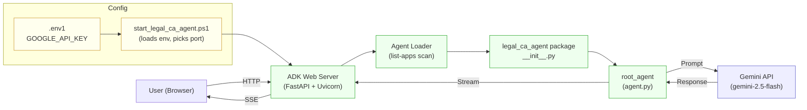

# Legal & CA Agent

This is a separate agent for legal and CA-related work.

## Purpose
- Drafting and reviewing legal document outlines
- GST and compliance checklists
- Accounting workflow support
- Business filing readiness
- Basic tax and compliance guidance

## Architecture



### Request flow
1. User opens `http://localhost:<port>` in a browser.
2. ADK Web serves the chat UI and calls `list-apps`.
3. Loader discovers `legal_ca_agent` from the project root.
4. On a message, ADK creates a session and calls `root_agent`.
5. `root_agent` sends the prompt to Gemini using the key from `.env1`.
6. Gemini streams a response back through ADK to the browser.

## Run it
From the project root:

```bash
python legal_ca_agent/main.py
```

## Secure API key setup
1. Copy `legal_ca_agent/.env.example` to `legal_ca_agent/.env1`.
2. Put your real key in `GOOGLE_API_KEY` inside `legal_ca_agent/.env1`.
3. Start with the secure launcher from project root:

```powershell
powershell -ExecutionPolicy Bypass -File .\legal_ca_agent\start_legal_ca_agent.ps1 -Port 8020
```

Open `http://localhost:8020` and select `legal_ca_agent`.

## Notes
- This agent is isolated from the travel app project.
- It is intended for assistance and planning, not final legal or CA advice.

