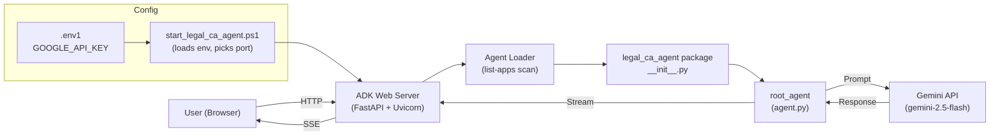
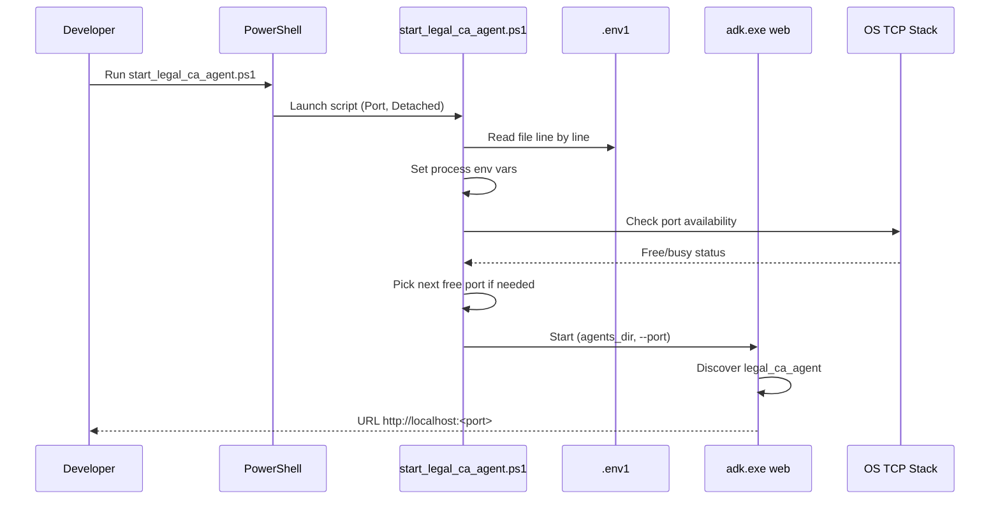
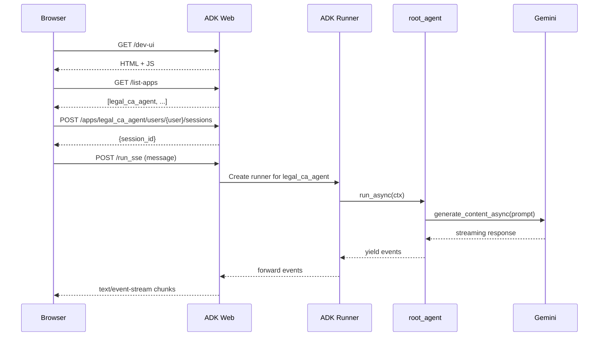

# Legal CA Agent — Technical Documentation

This document explains how the Legal & CA Agent works technically. It covers the runtime, components, data flow, configuration, and security. It is meant for developers who need to understand, extend, or debug the system.

## 1. Overview

The Legal CA Agent is a standalone AI assistant for legal and CA workflows. It is fully separate from the travel app project. It:
- Loads as an ADK (Agent Development Kit) application.
- Runs behind a local FastAPI/Uvicorn web server started by ADK.
- Uses Google's Gemini model (`gemini-2.5-flash`) to answer prompts.
- Reads its API key from a local file called `.env1`.
- Is launched by a PowerShell script that handles environment setup, port selection, and process control.

## 2. High-level architecture



## 3. Component breakdown

### 3.1 Package: `legal_ca_agent/`
This folder is a Python package. ADK Web discovers it as one of its apps.

Files:
- `__init__.py` — Exposes `agent` module and `root_agent` symbol so ADK's loader can find it.
- `agent.py` — Defines the actual `root_agent` (an `LlmAgent`) with name, model, description, and instruction.
- `main.py` — Local sanity check + printer for the correct launch command. It is not the real runtime for chat.
- `start_legal_ca_agent.ps1` — Launcher script for Windows PowerShell.
- `.env1` — Local file storing the API key (`GOOGLE_API_KEY`).
- `.env.example` — Template so contributors know what to create.

### 3.2 Agent definition (`agent.py`)
`root_agent` is a Google ADK `Agent` object:
- `name`: `legal_ca_agent`
- `model`: `gemini-2.5-flash`
- `description`: Short summary shown in ADK UI listings.
- `instruction`: The system prompt that shapes the assistant behavior.

Because ADK uses a Pydantic-based agent object, it does not have a `run()` method. It must be executed through the ADK runner, not directly.

### 3.3 Package exports (`__init__.py`)
ADK's app loader searches each app folder for:
- a module named `agent`, and
- inside it, an object named `root_agent`.

That is why `__init__.py` re-exports both:
```python
from . import agent
from .agent import root_agent
```
Without this, ADK returns errors like `module 'legal_ca_agent' has no attribute 'agent'`.

### 3.4 Launcher (`start_legal_ca_agent.ps1`)
Responsibilities:
1. Locate the project virtual environment ADK executable at `.venv/Scripts/adk.exe`.
2. Load `.env1` line by line and export each `KEY=VALUE` as a process environment variable.
3. Verify `GOOGLE_API_KEY` is present. If not, print an actionable message.
4. Pick a free TCP port starting at the requested value, incrementing if it is busy.
5. Print the final URL and start ADK:
   - Foreground (default): blocks the terminal, easy to stop with Ctrl+C.
   - Detached (`-Detached`): starts as a background process and prints its PID.

### 3.5 ADK Web Server
ADK CLI ships a FastAPI application served by Uvicorn. It:
- Serves the chat UI at `/dev-ui`.
- Exposes REST endpoints such as:
  - `GET /list-apps?relative_path=./` — discovers app folders.
  - `POST /apps/{app}/users/{user}/sessions` — creates a chat session.
  - `POST /run_sse` — runs a prompt and streams events via Server-Sent Events.
- Auto-scans the current agents directory (default: the folder ADK was started in) and treats each valid sub-folder as one app.

## 4. Startup flow



## 5. Request lifecycle



Key points:
- Chat is streaming (SSE). Each token or event is pushed to the browser as it is generated.
- Sessions are per-user and can be reused between messages.
- The system prompt (`instruction`) is included on every model call, so behavior stays consistent.

## 6. Configuration

### 6.1 `.env1`
Format (one variable per line, no quotes needed):
```
GOOGLE_API_KEY=AQ.your-real-key-here
```

Loaded by `start_legal_ca_agent.ps1` at startup. The launcher only reads it, it never prints the value.

### 6.2 `.gitignore`
`.env` and `.env1` patterns are already ignored so the key does not get committed.

### 6.3 Model
`agent.py` sets `model="gemini-2.5-flash"`. To change model:
- Edit `agent.py`.
- Restart the agent (kill the process, then rerun the launcher).

## 7. Ports and processes

- Default port is `8020`.
- If busy, launcher auto-increments up to `+24`.
- Foreground mode: process runs in the same terminal.
- Detached mode: process runs in the background, PID is printed.
- Stop a detached instance:
  ```powershell
  Get-NetTCPConnection -LocalPort 8020 -State Listen |
      ForEach-Object { Stop-Process -Id $_.OwningProcess -Force }
  ```

## 8. Error scenarios and diagnosis

| Symptom | Root cause | Fix |
|---|---|---|
| `module 'legal_ca_agent' has no attribute 'agent'` | Package does not export `agent` | Ensure `__init__.py` has `from . import agent` |
| `AttributeError: 'LlmAgent' object has no attribute 'run'` | Called `root_agent.run()` directly | Use ADK web/runner, not direct `.run()` |
| `ModuleNotFoundError: No module named 'deprecated'` | Running under system Python, not venv | Use venv-based launcher with absolute ADK path |
| `WinError 10048 ... address already in use` | Port already occupied | Launcher now auto-switches port |
| `No API key was provided` | `.env1` missing or key blank | Add `GOOGLE_API_KEY=...` to `.env1` |
| `403 PERMISSION_DENIED ... Lightning dunning ... deny` | Billing issue on Google Cloud project | Resolve payment/add card in Google Cloud Billing |

## 9. Security

Practices used:
1. Keys live only in `.env1`, never in code or logs.
2. `.env1` is gitignored.
3. Launcher never echoes the key value.
4. Server binds to `0.0.0.0` for local testing, but is intended only for `localhost` usage. For production, front it with an authenticated proxy.
5. Prompts and responses are not logged persistently by the ADK dev server by default.

Do:
1. Rotate keys if they were ever pasted in chat, screenshots, or shared systems.
2. Use different keys per environment (dev/prod).
3. Restrict the API key in Google Cloud Console to specific APIs and referrers where possible.

## 10. Extending the agent

Typical additions:
- New system behavior: edit the `instruction` string in `agent.py`.
- New tools: add function tools and register them on the agent (ADK tool APIs).
- New sub-agents: create additional agent folders alongside `legal_ca_agent` and let ADK auto-discover them.
- New model provider: change `model` and any provider-specific env vars.
- Programmatic access: build a thin FastAPI or CLI client that calls the ADK `run_sse` endpoint.

## 11. Deployment notes

For a real deployment (not localhost):
1. Package the venv with dependencies (`requirements.txt`).
2. Run ADK behind a reverse proxy (Caddy, Nginx) with HTTPS.
3. Store the API key in a secret manager (Google Secret Manager, HashiCorp Vault) instead of `.env1`.
4. Use containers (Docker) with an unprivileged user.
5. Add authentication and rate limiting at the proxy layer.

## 12. Quick reference

Start:
```powershell
& "C:\Hack2skill-Phase-2-GenAI-Hackathon-Triplix\Hack2skill-Phase-2-GenAI-Hackathon-Triplix\legal_ca_agent\start_legal_ca_agent.ps1" -Port 8020
```

Open:
- http://localhost:8020

Select app:
- `legal_ca_agent`

Programmatic test (PowerShell):
```powershell
$base = "http://localhost:8020"
$app = "legal_ca_agent"
$user = "tester"
$s = Invoke-RestMethod -Method Post -Uri "$base/apps/$app/users/$user/sessions" -ContentType 'application/json' -Body '{}'
$body = @{
    app_name = $app; user_id = $user; session_id = $s.id
    new_message = @{ role = 'user'; parts = @(@{ text = 'Explain input tax credit under GST in 5 bullets.' }) }
} | ConvertTo-Json -Depth 6
(Invoke-WebRequest -UseBasicParsing -Method Post -Uri "$base/run_sse" -ContentType 'application/json' -Body $body).Content
```
